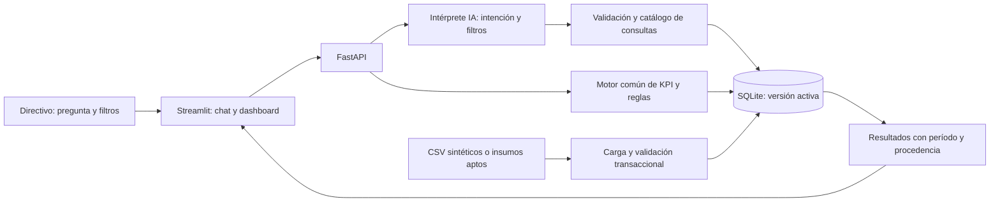

# Análisis de viabilidad y hoja de ruta del reto hospitalario

Fecha: 23 de septiembre de 2026. Equipo confirmado: tres personas.

> Actualización: este informe se elaboró antes de disponer de los archivos HIS. La [evaluación posterior con EDA y análisis de las propuestas](./Evaluacion_propuestas_triage_RAG_Jev.md) actualiza la disponibilidad, calidad y limitaciones de los datos. Las afirmaciones sobre ausencia de insumos describen el momento de esta primera revisión.

**Dictamen:** viable como MVP demostrable en ocho horas, condicionado a experiencia suficiente con Python, un contrato de datos cerrado al inicio y un alcance conversacional acotado. No es viable comprometer en ese plazo un sistema hospitalario de producción, integración real con todos los sistemas, predicción validada y optimización automática de recursos.

Este documento contiene exclusivamente análisis y planificación. No se ha desarrollado código, generado datos de prueba, configurado infraestructura ni ejecutado pruebas del futuro producto.

## 1. Base del análisis y límites de la evidencia

La fuente funcional es [Descripción_Reto_Hackaton.md](./Descripción_Reto_Hackaton.md). Sus instrucciones de construcción describen el reto futuro; la solicitud vigente del usuario limita este trabajo a analizarlo y planificarlo.

En el directorio examinado se encontró el enunciado y un README vacío, sin aplicación ni archivos de datos del reto. La expresión «Insumos Hackaton» no incluye en el documento una ubicación utilizable. Esto no demuestra que esos insumos no existan fuera del directorio.

Se ha confirmado el tamaño del equipo, pero no su experiencia, disponibilidad de API, conectividad, recursos económicos ni esquema real de los insumos. El cronograma supone tres personas disponibles durante las ocho horas y al menos experiencia práctica suficiente para repartir datos/SQL, backend/IA e interfaz/integración. Si estas condiciones no se cumplen, la estimación pierde fiabilidad.

La recomendación busca reducir tiempo hasta una demostración correcta. No se afirma una optimalidad absoluta: sin mediciones, datos y capacidades del equipo, solo puede justificarse la alternativa más proporcionada bajo estos supuestos.

## 2. Análisis de requisitos y contradicciones

| Condición del documento | Interpretación y compromiso propuesto |
|---|---|
| MVP funcional en ocho horas | Alcance cerrado, ejecución local reproducible y reserva explícita para validación y presentación. |
| Asistente conversacional como núcleo | Preguntas naturales y paráfrasis sobre las cinco familias de indicadores; respuestas calculadas desde la base. |
| Dashboard con KPI hospitalarios | Tarjetas, filtros, evolución de ocupación, espera por triage, cumplimiento quirúrgico, farmacia y demanda. |
| Carga y análisis histórico de admisiones, camas, quirófanos y farmacia | Importación CSV validada. Añadir solicitudes por especialidad para medir esa parte de la demanda. |
| Cinco familias de KPI | Todas incluidas en su versión descriptiva mínima. Las cuatro preguntas de la demo no sustituyen esta cobertura. |
| Sugerir acciones o recomendaciones | Alertas de cobertura de inventario y recomendaciones operativas basadas en reglas, sujetas a revisión humana. |
| Datos anónimos; no revelar nombres, documentos o diagnósticos específicos | Demo enteramente sintética, sin atributos individuales innecesarios y con respuestas agregadas. |
| Credenciales en variables de entorno y fuera del repositorio | Archivo local de secretos excluido de Git; configuración de ejemplo sin valores reales. |
| Documentación, compatibilidad y demostración | README, versiones fijadas, instrucciones desde cero, roles, limitaciones y demo funcional o video. |
| Stack, nube, patrones, JWT y roles sugeridos | Recomendaciones, no obligaciones equivalentes al alcance funcional. Elegir solo lo necesario. |

**Brecha de datos:** las tres tablas sugeridas no soportan todos los indicadores. El estado actual de una cama no reconstruye su historia; ingreso y salida no revelan la espera; faltan cirugías, consumos históricos y solicitudes por especialidad. Ampliar el modelo es necesario y compatible con un esquema presentado como mínimo recomendado.

**Privacidad:** el documento prohíbe mostrar diagnósticos específicos y después recomienda una tabla individual con diagnóstico y médico. Debe prevalecer la condición explícita de confidencialidad. Sustituir esa tabla por agregados operativos. Eliminar nombres o conservar identificadores seudónimos no prueba anonimización; los datos sintéticos evitan ese problema en la demo.

**Actualidad:** existe una necesidad institucional de tiempo real, pero el alcance permite carga histórica y menciona la integración clínica como mejora futura. El MVP debe anunciar actualización por lotes y mostrar su fecha de corte. No debe presentar una carga CSV como integración en tiempo real.

**Inteligencia y causalidad:** el ejemplo de aumento del 20 % de neumonía no constituye un requisito de precisión ni una predicción demostrada. Las asociaciones por turno o triage pueden describirse, pero no presentarse como causas probadas. Tampoco se recomendarán tratamientos a pacientes.

## 3. Viabilidad profesional

| Dimensión | Evaluación | Condición decisiva |
|---|---|---|
| Técnica | Viable para analítica descriptiva y consultas acotadas | Compartir cálculos entre chat y dashboard y limitar el lenguaje consultable. |
| Datos | Condicionada | Conseguir los campos necesarios o usar un conjunto sintético claramente identificado. |
| Plazo | Ajustado pero defendible con tres personas experimentadas | Integración temprana, módulos pequeños y cero extras antes de cerrar requisitos. |
| Económica | Viable con ejecución local y consumo acotado de API | Verificar acceso, tarifa vigente y presupuesto antes del evento; no asumir créditos ni alojamiento gratuito. |
| Operación real | Fuera del plazo | Requeriría integración, control de acceso, privacidad, operación y validación institucional adicionales. |
| Impacto hospitalario | No demostrado todavía | El MVP prueba consulta y trazabilidad; reducir esperas o gasto exige evaluación posterior. |

Los 500 pacientes diarios describen actividad, no usuarios simultáneos, camas ocupadas ni tamaño total de la base. Como escenario ilustrativo, un episodio por cada atención equivaldría a 182.500 episodios al año; los movimientos de farmacia pueden ser mucho más numerosos. No hay evidencia que justifique microservicios o infraestructura distribuida para la demo.

El coste de API se estimará con: consultas × (tokens de entrada × tarifa de entrada + tokens de salida × tarifa de salida), ajustando a la unidad tarifaria del proveedor. Limitar a una llamada al modelo por consulta, sin segunda llamada para redactar cifras, reduce latencia, variabilidad y coste. No se dispone de evidencia para ofrecer un presupuesto monetario exacto.

## 4. Arquitectura recomendada

**Streamlit + Plotly para interfaz; FastAPI para contratos; Python/Pandas para carga; SQLite para persistencia; un modelo accesible por API para interpretar preguntas.** Todo se ejecutaría en un equipo local, con la base propiedad exclusiva del backend. Frontend y backend no compartirían un archivo SQLite entre proveedores de nube.

Es una aplicación modular con dos procesos locales, sin distribución adicional de servicios. FastAPI introduce un pequeño coste de integración, pero permite asignar backend e interfaz a personas distintas y conserva los contratos de API sugeridos. Un único proceso Streamlit sería una alternativa más breve si el equipo domina esa opción; no es necesario introducirlo como segundo diseño a desarrollar.

Contratos mínimos previstos:

- `POST /api/query`: pregunta, contexto temporal y filtros; devuelve interpretación, resultado, unidad, período, versión de datos, advertencias y modo IA/contingencia.
- `GET /api/kpis`: mismos filtros y versión, usando el mismo motor de cálculo.
- Carga desde la interfaz mediante una operación controlada del backend. Se necesita un contrato adicional de importación si se mantiene esta separación; los dos endpoints sugeridos no cubren por sí solos la carga interactiva.

No añadir una base vectorial, RAG documental, entrenamiento de modelos, agentes autónomos, colas o un frontend personalizado. No resuelven una necesidad demostrada de este MVP.

### 4.1 Decisión sobre NL2SQL

La ruta preferida por eficiencia y control es **lenguaje natural → intención y filtros validados → generación de SQL parametrizado desde un catálogo**. El agente produce una consulta real y sus resultados, pero el modelo no tiene libertad para inventar tablas, fórmulas o instrucciones SQL.

El modelo aportaría comprensión de paráfrasis, servicio, triage, medicamento, fechas y agrupación. Un catálogo de cinco familias admite variaciones útiles; no se limita a reconocer cuatro frases exactas. Los valores ambiguos requieren aclaración y las preguntas fuera de alcance reciben una explicación.

Debe presentarse como conversión controlada de lenguaje natural a consultas SQL, sin afirmar generación libre. El documento admite reglas y SQL predefinido como contingencia, pero describe también SQL generado por el modelo. Por ello, **la aceptación de la interpretación restringida por el jurado es una incertidumbre explícita** que conviene resolver en los primeros 30 minutos, sin detener las tareas independientes.

Si el organizador exige que el modelo emita SQL textual, conservar el resto de la arquitectura y permitir únicamente una consulta sobre vistas analíticas autorizadas, con gramática reducida, sin acceso a tablas de origen, escrituras, múltiples sentencias, uniones arbitrarias ni funciones no previstas. Esta variante aumenta trabajo y riesgo; necesita validación estructural y controles del motor. Un parser por sí solo no certifica seguridad ni corrección: [SQLGlot advierte que es un parser/transpilador, no un validador](https://sqlglot.com/).

El modelo concreto mencionado en el enunciado es una recomendación. La decisión futura debe basarse en acceso real, comprensión del español, formato de salida, latencia y coste comprobados en el entorno del evento; no en asumir disponibilidad a partir del documento.

### 4.2 Controles mínimos

El backend controlará nombres de tablas, columnas, agrupaciones y ordenación; los valores se vincularán como parámetros. No bastan filtros de palabras o escapes. Esta separación sigue las defensas de [consultas parametrizadas y listas permitidas de OWASP](https://cheatsheetseries.owasp.org/cheatsheets/SQL_Injection_Prevention_Cheat_Sheet.html).

Separar la conexión de escritura del importador de la conexión de consultas de solo lectura. SQLite permite abrir esta última con `mode=ro`; si se admite SQL externo, su autorizador permite restringir operaciones y accesos. Esas capacidades no sustituyen la validación de negocio ni impiden por sí solas lecturas sensibles. Referencias: [apertura de solo lectura](https://www.sqlite.org/uri.html) y [autorización de SQLite](https://www.sqlite.org/c3ref/set_authorizer.html).

Aplicar límites configurables de tamaño de archivo, intervalo consultado, filas devueltas y duración. Como presupuesto inicial de demo: una llamada IA con máximo de 10 segundos, consulta local con máximo de 2 segundos y 200 filas de salida. Son límites propuestos que deben comprobarse, no rendimientos medidos; limitar filas no limita por sí solo el trabajo SQL.

La demo será local y sintética. No incorporar filas clínicas al contexto del modelo, ni claves a respuestas o registros. También las preguntas pueden contener información sensible: el guion y las pruebas usarán preguntas sintéticas, sin asumir que retirar datos de la base elimina ese canal.

## 5. Contrato de datos mínimo

Cinco conjuntos bastan para un modelo analítico pequeño, siempre que las fuentes puedan proporcionarlos:

| Conjunto | Granularidad | Campos esenciales |
|---|---|---|
| Censo de camas | Servicio y fecha/hora de corte | Camas operativas, camas ocupadas, servicio y corte. |
| Episodios de atención | Un episodio | Identificador de episodio, llegada, primera atención, ingreso hospitalario si aplica, servicio, triage y estado. |
| Cirugías | Una cirugía de la agenda | Identificador, fecha programada de referencia, fecha de realización, estado y quirófano para segmentar. |
| Farmacia diaria | Producto y día | Identificador, nombre, unidad, consumo y stock utilizable al corte. |
| Solicitudes de servicio | Una solicitud | Identificador, fecha, servicio, especialidad y estado. |

No se necesitan nombre, documento, diagnóstico específico ni una tabla de pacientes para responder las cuatro preguntas oficiales. El identificador de episodio evita confundir atenciones con personas únicas.

La importación debe comprobar esquema, tipos, claves, duplicados, fechas y dominios. Un archivo inválido no reemplaza la versión válida. La publicación del lote completo es transaccional: chat y dashboard consumen una única versión activa. Recargar el mismo lote no duplica registros.

Para la demo, adoptar censos diarios a hora fija es más simple que reconstruir movimientos de camas. Debe etiquetarse como ocupación **al corte diario**. No equivale a ocupación media intradiaria ni permite descubrir picos. Si se exige una media continua, son necesarios intervalos de ocupación y capacidad para integrar camas-tiempo; esa decisión depende de los insumos.

### 5.1 Definiciones de los KPI

| Indicador | Cálculo y alcance | Casos que no deben ocultarse |
|---|---|---|
| Ocupación al corte | 100 × camas ocupadas / camas operativas del servicio. | Capacidad cero: no calculable. Ocupadas mayores que operativas: incidencia, sin recortar al 100 %. |
| Ocupación mensual | 100 × suma de ocupadas en censos / suma de operativas en los mismos censos. Además, media de camas ocupadas = suma de ocupadas / días observados. | La tasa es ponderada por capacidad. Mostrar días disponibles/esperados; no llamar completo a un mes con huecos. |
| Espera por triage | Media de minutos entre llegada y primera atención; cohorte por fecha de llegada. | No usar salida menos ingreso. Excluir valores negativos y mostrar pendientes y registros inválidos aparte. |
| Cumplimiento quirúrgico | 100 × cirugías de la cohorte programada realizadas / cirugías de esa cohorte programadas. | Mantener canceladas en denominador; separar urgencias no programadas. Conservar agenda de referencia ante reprogramaciones. |
| Consumo y rotación | Consumo total por producto y período; rotación = consumo / inventario medio observado del mismo producto y período. | Etiquetar método del promedio de stock y unidad. No comparar ciegamente tabletas con ampollas. Inventario medio cero: razón no calculable. |
| Demanda | Episodios ingresados por servicio; solicitudes distintas por especialidad. | Ingresos, solicitudes y personas únicas son medidas diferentes. Admisiones no mide demanda no atendida. |

En farmacia, el inventario medio puede aproximarse con la media de existencias de los cortes diarios completos; debe indicarse como estimación basada en cortes. Si solo existe stock actual, mostrar cobertura y consumo disponible, y declarar la rotación histórica no calculable. Los productos sin consumo deben aparecer en el extremo de menor consumo si existe evidencia de días observados con cero.

El cociente quirúrgico solicitado no mide utilización horaria. Esta última necesitaría tiempo ocupado y tiempo disponible. No llamar «optimización de agenda» a ordenar cirugías por fecha o a mostrar cancelaciones.

### 5.2 Recomendaciones y tiempo de referencia

La alerta principal será cobertura estimada inferior a cinco días:

**Cobertura = stock utilizable al corte / consumo diario medio de los siete días completos previos.**

La ventana de siete días es una decisión propuesta, no una exigencia del reto. Incluir días observados con cero consumo y distinguirlos de días faltantes. Consumo medio cero implica cobertura no estimable; stock cero con consumo positivo implica cero días. El umbral es estrictamente menor que cinco.

El stock utilizable debe excluir vencidos o bloqueados. Si la fuente no lo permite, declarar que la cobertura usa stock registrado y que no se ha verificado disponibilidad utilizable. La regla supone consumo constante; no es un pronóstico validado ni una orden de compra.

Una segunda regla puede sugerir revisar capacidad cuando la ocupación exceda un umbral configurable. Cualquier umbral de demo será ilustrativo, pendiente de validación hospitalaria. La sugerencia de abrir camas requiere revisar personal, equipamiento y condiciones operativas; no se ejecutará automáticamente.

Usar America/Bogota y una fecha de referencia visible. Definir «última semana» como siete días completos anteriores y «este mes» desde el primer día hasta el corte. Las fechas históricas no deben desplazarse en silencio para que parezcan actuales. «Hoy» responde con el corte disponible de ese día, mostrando antigüedad, o declara ausencia de datos.

## 6. Optimización y principales cuellos de botella

1. **Datos y semántica antes que interfaz.** Cerrar campos y cinco cálculos con ejemplos pequeños evita construir gráficos de indicadores incorrectos.
2. **Una sola lógica numérica.** Chat, dashboard y contingencia reutilizan cálculos y reglas; el modelo no calcula ni inventa valores.
3. **Una llamada IA por pregunta.** El servidor compone la respuesta y los gráficos desde resultados comprobables, sin una segunda generación narrativa.
4. **Consultas acotadas.** Catálogo limitado y filtros controlados reducen superficie de fallo, coste de pruebas y latencia.
5. **Carga fuera de la ruta de consulta.** Validar y agregar una vez por versión. Evitar releer todos los CSV ante cada interacción.
6. **Caché con versión y filtros.** La caché de Streamlit usa argumentos para distinguir resultados; incorporar versión del dataset, período y filtros previene reutilizar cifras de una carga anterior. Ver [documentación de caché de Streamlit](https://docs.streamlit.io/develop/concepts/architecture/caching).
7. **Infraestructura local.** Reduce dependencias de despliegue, credenciales y redes. El acceso al modelo sigue siendo una dependencia externa, cubierta con contingencia.
8. **Reserva protegida.** Quitar extras antes de reducir pruebas o ensayo de la demo.

Con n filas, la lectura y validación básica requieren un recorrido O(n); mantener todo en Pandas puede consumir O(n) memoria. Si el archivo excede el presupuesto acordado, importar por bloques. Crear índices solo para fechas, servicio y producto cuando lo justifique el patrón de consulta; no prometer O(1) para agregaciones. Sobre datos agrupados, recorrer k filas pertinentes puede ser mucho menor que recorrer n eventos, pero la diferencia debe medirse.

El mayor riesgo inicial es la ausencia de datos suficientes. Le siguen la discrepancia entre definiciones, la integración tardía y la dependencia de API. No hay mediciones que permitan atribuir ahora el cuello de botella a SQLite o al renderizado.

## 7. Hoja de ruta: ocho horas, tres personas

Roles propuestos: **A**, datos y KPI; **B**, backend y agente; **C**, interfaz, integración y presentación. Las 24 horas-persona nominales no son 24 horas independientes: hay coordinación y tareas compartidas. El plan incluye esas dependencias.

| Tiempo transcurrido | Acciones por responsable | Resultado y criterio de salida |
|---|---|---|
| 0:00–0:30 | Los tres revisan insumos, fórmulas, fecha de demo y alcance. B comprueba API y aclara la interpretación de NL2SQL con organización si es posible. C registra tablero y contratos. | Lista cerrada de requisitos; cinco esquemas; decisión de fuente; cuatro respuestas esperadas para un conjunto pequeño. Si faltan insumos, adoptar datos sintéticos etiquetados. |
| 0:30–1:30 | A prepara conjunto mínimo y carga validada. B prepara contratos API, catálogo y consulta de ocupación. C arma estructura de interfaz y filtros contra el contrato acordado. | Primera consulta de referencia reproducible y estructura compartida de respuestas. Credenciales disponibles o contingencia activada. |
| 1:30–2:00 | Los tres integran carga → base → API → tarjeta y pregunta de ocupación. | Primer recorrido completo con cifras reales de la base. Resolver integración antes de ampliar funciones. |
| 2:00–3:30 | A desarrolla espera, farmacia, cirugía y demanda con referencias pequeñas. B incorpora interpretación y controles. C incorpora tarjetas y gráficos a medida que se estabilizan contratos. | Cinco familias calculables; agente interpreta preguntas y filtros; errores visibles. |
| 3:30–4:30 | A añade reglas y calidad de datos. B integra contingencia y límites. C conecta chat, tablas, gráficos y metadatos temporales. | Cuatro preguntas oficiales funcionando, todas las familias visibles, alertas y modo sin API disponibles. |
| 4:30–5:30 | Los tres verifican integración y recarga. A contrasta números; B prueba rechazos; C prueba recorrido completo. | Carga atómica, cifras coincidentes y ausencia de datos inventados. Si hay retraso, retirar extras visuales y despliegue remoto. |
| 5:30–6:30 | Pruebas de aceptación repartidas, corrección de fallos y verificación de cambios. | Cuatro preguntas y paráfrasis aprobadas, casos límite controlados y contingencia demostrada. Cierre de funcionalidades. |
| 6:30–7:00 | C cierra README, arquitectura y presentación. A documenta fórmulas/fuentes. B documenta configuración, límites y ejecución. Otra persona prueba arranque siguiendo README. | Ejecución desde cero reproducible; repositorio sin secretos; limitaciones explícitas. |
| 7:00–8:00 | Ensayo de demostración, preparación de video de respaldo y margen para bloqueos críticos. | Demo preparada, respaldo accesible y versión estable identificada. No introducir funciones nuevas. |

Dependencia principal: **contrato de datos → carga válida → KPI de referencia → integración → aceptación → presentación**. IA e interfaz pueden avanzar en paralelo tras fijar contratos, pero no inventar definiciones distintas.

No priorizar nube, login opcional, predicción, integración clínica, modelo local, PDF exportable o diseño personalizado antes de completar esa cadena. Si una función obligatoria queda pendiente, declarar el MVP incompleto; no ocultarlo como una reducción de alcance exitosa.

## 8. Criterios de aceptación

| Prueba | Resultado exigido |
|---|---|
| Camas UCI ocupadas hoy | Conteo coincidente con censo de referencia, servicio y fecha visibles. |
| Medicamentos con menos de cinco días | Cobertura calculada y umbral correcto; consumo cero/faltante tratado explícitamente. |
| Espera media en urgencias de la última semana | Coincide con cálculo independiente para cohorte y fechas declaradas; muestra pendientes. |
| Servicio con más ingresos del mes | Episodios contados correctamente y empates tratados sin seleccionar arbitrariamente. |
| Al menos una paráfrasis por pregunta oficial | Misma interpretación y cifra para los mismos filtros; no depender de coincidencia literal. |
| Cinco familias de KPI | Fórmula, unidad, período, denominador y evidencia de referencia revisados. |
| Archivo inválido y recarga repetida | Mensaje útil; versión anterior preservada; sin duplicación. |
| Cambio de versión | Chat y dashboard reflejan la misma carga y no sirven caché antigua. |
| Solicitud de datos individuales o modificación de la base | Rechazo sin filtración ni cambios. Probar comillas, instrucciones de omitir reglas y SQL introducido como filtro. |
| Datos vacíos, denominador cero y fechas inválidas | Distinguir cero, sin datos y no calculable. |
| API caída o respuesta inválida del modelo | Modo de contingencia visible, consultas reales y sin cifras inventadas. |
| Recomendaciones | Evidencia, regla y fecha visibles; ninguna acción operativa se ejecuta. |
| Arranque y demo | Otro integrante inicia desde README y reproduce el guion. |

La verificación numérica debe usar referencias independientes y pequeñas, no solo comparar componentes que comparten la misma fórmula: ambos podrían compartir un error. Una API que devuelve éxito no demuestra exactitud.

Objetivos propuestos de experiencia: KPI locales por debajo de dos segundos y respuesta conversacional dentro de quince segundos, medidos desde la acción del usuario. El segundo presupuesto incluye hasta diez segundos de API, hasta dos de consulta y margen para validación y presentación. Registrar equipo, volumen de datos y si intervino caché. Estos son objetivos de aceptación pendientes de ajuste, no resultados de pruebas ejecutadas.

El guion de demostración mostrará carga y corte temporal, las cuatro preguntas oficiales, una paráfrasis, un indicador quirúrgico y otro de especialidades, una alerta y la contingencia. Así cubre tanto los ejemplos del documento como el alcance que esos ejemplos no recorren.

## 9. Continuidad después del hackathon

Una evolución a piloto requeriría primero validar definiciones con los responsables hospitalarios, identificar sistemas fuente y permisos de acceso, y evaluar calidad/actualización real. Después: identidad y autorización, trazabilidad, protección de datos, integración gradual, recuperación y pruebas de carga con volumen medido. La evaluación jurídica y de privacidad debe realizarse sobre el tratamiento concreto; este informe no certifica cumplimiento.

Las predicciones vendrían después de disponer de historia suficiente, una referencia simple contra la cual comparar y validación temporal. La optimización de cirugías necesitaría restricciones de duración, personal, equipos, salas y prioridades. La producción solo debería plantearse tras un piloto controlado y aceptación institucional; no tiene un plazo defendible con la información disponible.

**Estado de este trabajo:** análisis documental completado, contraste independiente de datos y seguridad realizado, y documentación técnica primaria consultada. Ningún componente del MVP ha sido implementado ni probado. La viabilidad permanece condicionada a las capacidades del equipo, la fuente de datos y el criterio de evaluación de NL2SQL.
