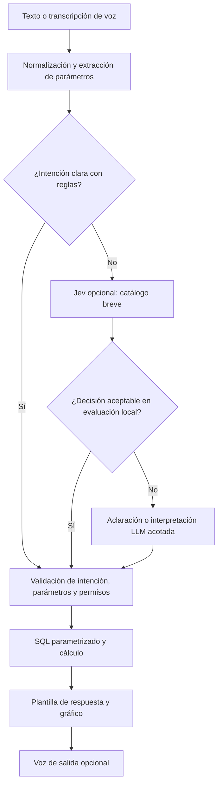

# Evaluación de EDA y lógica difusa, RAG y enrutamiento con Jev

23 de septiembre de 2026. Alcance: análisis técnico y perfilado local, sin desarrollar el producto ni entrenar modelos.

**Dictamen:** aprobar EDA y normalización determinista; no incorporar reclasificación clínica difusa ni vectorización masiva al MVP; evaluar Jev como respaldo semántico para preguntas administrativas, sin pasar obligatoriamente todas las consultas a un LLM. La voz sería una interfaz opcional posterior al flujo textual correcto.

No puede garantizarse una solución «100 % óptima» simultáneamente en latencia, consumo, precisión, mantenibilidad y seguridad sin fijar prioridades y medir cargas representativas. El objetivo defendible es minimizar coste y latencia sujeto a corrección y cobertura verificadas. Ni un modelo ni reglas escritas manualmente garantizan por sí solos precisión clínica.

## 1. Evidencia nueva y alcance del EDA

Se leyeron el diccionario, el glosario y los siete archivos de datos. Durante la revisión, Servicios y MedicamentoInsumo quedaron ubicados dentro de `Datos/Dir`; se localizaron y analizaron allí. No se contó el RAR como una fuente adicional.

El perfilado se realizó localmente con Python 3.12.14 y Pandas 3.0.1, sin enviar registros a servicios de IA. [Evidencia_EDA_HIS.json](./Evidencia_EDA_HIS.json) conserva estadísticas agregadas, rutas y hashes SHA-256. No contiene registros individuales, nombres ni motivos de consulta.

La lectura usa UTF-8, separador `|`, comillas literales y fechas con formato ISO explícito. Se verificó el número de campos de cada línea: ninguna línea no vacía incumplió su esquema. Interpretar estos TXT como CSV con comillas delimitadoras puede fusionar registros clínicos; inferir fechas ambiguamente también altera los intervalos. El perfil final corrige ambos problemas y concuerda con los conteos del diccionario.

| Tabla | Filas |
|---|---:|
| Paciente | 14.502 |
| Ingresos | 17.781 |
| Triage | 17.781 |
| Atencion | 17.375 |
| Servicios | 582.357 |
| MedicamentoInsumo | 579.465 |
| ProgramacionCirugia | 13.046 |
| Total | 1.242.307 |

Los archivos suman 187,23 MiB. El grueso del volumen corresponde a servicios y dispensaciones, no a narrativas clínicas extensas. El período observado de triage e ingresos va del 1 de mayo al 21 de septiembre de 2026; servicios y medicamentos llegan al 22 de septiembre.

Hallazgos decisivos:

- **16.106 registros de triage tienen identificador y clasificación; 1.675 filas están completamente vacías (9,42 %).** Las filas vacías no son casos clínicos para imputar o entrenar.
- Hay **24 códigos operativos**, pero cuatro niveles de prioridad observados. `01` corresponde a una descripción de TRIAGE 3 y `04` a TRIAGE 1: no convertir directamente el código a severidad.
- Distribución entre clasificados: I = 443; II = 1.560; III = 11.891; IV = 2.212; V = 0. Siempre predecir III daría 73,83 % de exactitud aparente: esa métrica aislada no acredita utilidad clínica.
- Se observaron extremos como frecuencia cardiaca 1.154, frecuencia respiratoria 480 y temperatura 3.636. Hay 90 presiones con algún componente cero y 52 con sistólica menor que diastólica. Son incidencias a investigar, no valores que deban corregirse automáticamente por adivinación.
- Las claves de triage no nulas son únicas y todas las referencias de Ingresos a ellas existen. **Cuatro enlaces presentan discordancia entre el paciente de Ingresos y el de Triage**; necesitan revisión antes de análisis clínico conjunto.
- Hay 406 ingresos sin registro de primera atención. No equivalen automáticamente a pacientes actualmente esperando: pueden reflejar incompletitud del extracto u otro proceso.
- `FechaAtencion − FechaTriage` puede calcularse en 16.106 vínculos; `FechaAtencion − FechaIngreso`, en 17.375. Son intervalos distintos. No existe una hora de llegada independiente demostrada por el diccionario.
- Servicios y medicamentos tienen claves únicas, cantidades numéricas positivas y referencias a ingresos presentes, según las comprobaciones efectuadas. Esto no certifica toda su calidad semántica.

El EDA respalda decisiones de arquitectura, pero no constituye validación clínica, auditoría integral de anonimización ni evaluación de modelos. No se ejecutaron Jev, LLM, reconocimiento de voz, embeddings ni un clasificador difuso.

## 2. Idea 1: EDA más lógica difusa para clasificar triage

### Qué aprobar

**El EDA es necesario.** El primer entregable útil es un catálogo revisado que separe código operativo, circuito asistencial y prioridad I–V. El sistema puede mostrar distribución de prioridades y tiempos por la clasificación que ya asignó el profesional, sin volver a inferirla.

La transformación de los 24 códigos observados a niveles conocidos se resuelve con una tabla de correspondencia versionada. Consultar cada código tiene coste esperado O(1) mediante un diccionario; procesar n registros requiere O(n). Los códigos nuevos o contradictorios deben quedar como desconocidos hasta revisión. Una expresión regular sobre la descripción ayuda a construir y comprobar el catálogo, pero no debería reemplazar una definición validada permanentemente.

### Qué corregir en la comparación

**Lógica difusa y ejecución determinista no son opuestos.** Un sistema difuso con reglas y funciones de pertenencia fijas puede ejecutar localmente y consumir cero tokens. La diferencia frente a reglas de umbral es la pertenencia gradual, la combinación de reglas y, según el método, la transformación de la salida. La [documentación de scikit-fuzzy](https://scikit-fuzzy.github.io/scikit-fuzzy/auto_examples/plot_tipping_problem_newapi.html) ilustra ese esquema.

Con pocas variables y reglas, su coste puede ser pequeño. No se descarta por ser necesariamente pesado: se descarta del MVP porque añade decisiones clínicas y calibración sin un beneficio demostrado para consultar datos que ya están clasificados.

Para reglas difusas, el coste depende del número de reglas activadas y del método de inferencia; algunas implementaciones agregan un coste por discretización de la salida. Una regla por cada combinación de m conjuntos en v variables crecería como m^v, aunque un diseño disperso puede evitarlo. No es necesario pagar ese coste para recuperar etiquetas existentes.

### Si la intención es clasificar pacientes nuevos

Se trataría de una ampliación sustancial del reto original, centrado en gestión hospitalaria. Los datos tienen signos vitales y motivo libre, pero no una representación estructurada completa de todos los elementos de evaluación clínica; por ejemplo, saturación, conciencia o dolor no aparecen como columnas específicas. Su posible presencia en texto no garantiza disponibilidad sistemática.

La Resolución 5596 describe triage como valoración clínica y asigna responsabilidades a personal sanitario, incluida la reevaluación. No proporciona una función universal de cuatro signos vitales a una categoría. Por ello, ni una función difusa ni un conjunto de umbrales inventados por ingeniería serían sustitutos validados de la metodología institucional. [Fuente primaria del Ministerio de Salud](https://www.minsalud.gov.co/Normatividad_Nuevo/Resoluci%C3%B3n%205596%20de%202015.pdf).

Para estudiar una herramienta de apoyo posterior harían falta:

1. Protocolo institucional y profesionales que definan reglas, entradas y criterios de abstención.
2. Revisión de calidad, unidades y población, incluida diferenciación pediátrica cuando corresponda. Calcular edad a la fecha del episodio, no a la fecha actual.
3. Referencia clínica revisada: la etiqueta histórica no es automáticamente verdad clínica independiente.
4. Partición temporal con control de pacientes repetidos. Evitar que un mismo paciente permita memorizar características entre entrenamiento y evaluación.
5. Evitar filtración: diagnóstico posterior, hospitalización, servicios prestados y la descripción que ya contiene TRIAGE no son entradas válidas para predecir la prioridad inicial.
6. Comparación con reglas clínicas de referencia, por clase y subgrupos: sensibilidad de alta prioridad, subclasificación, sobreclasificación, abstención e incertidumbre. La ausencia de nivel V impide evaluar esa clase en este extracto.

**Veredicto:** EDA y normalización, sí; clasificador clínico difuso, investigación posterior. Tampoco recomendar un clasificador clínico de umbrales solo porque sea rápido. Mantener reglas auditables en tablas de configuración evita una acumulación frágil de condiciones dispersas.

## 3. Idea 2: RAG para vectorizar información de pacientes

### Encaje con los datos

Vectorizar es una posible etapa de recuperación; no equivale a construir RAG. RAG también puede recuperar mediante SQL o búsqueda textual. Para este reto, las preguntas principales piden filtros, conteos, sumas, promedios y relaciones exactas: **la recuperación estructurada es la opción de partida**.

Una búsqueda de los k textos más parecidos no garantiza recuperar todos los episodios necesarios para calcular una tasa. Promediar solo los resultados recuperados cambia el denominador. Además, similitud semántica no garantiza identidad del paciente, vigencia temporal, unidad de medicamento ni correspondencia de episodio.

Diseño recomendado:

- Importar las tablas una vez, preservando tipos y claves; mantener fechas y códigos normalizados.
- Índices para relaciones y filtros frecuentes, seleccionados mediante las consultas reales.
- Catálogo de consultas parametrizadas y agregados reutilizables por día, área o prioridad cuando sean útiles.
- Evitar unir simultáneamente Servicios y MedicamentoInsumo directamente a nivel de sus líneas: las relaciones uno-a-muchos multiplicarían filas y cantidades. Agregar cada conjunto al nivel requerido antes de combinarlos.
- Recuperar por identificador exacto cuando corresponda una consulta autorizada sobre un episodio. La identidad no se resuelve por similitud vectorial.

### Dónde podría ayudar la búsqueda textual

Hay 16.093 motivos de consulta no vacíos, con mediana de 404 caracteres y máximo de 2.564. Si surge una tarea autorizada de búsqueda semántica en narrativas, existe un candidato acotado; no es necesario convertir todas las filas del HIS en documentos.

Primero comparar búsqueda léxica y un glosario de sinónimos. SQLite FTS5 ofrece búsqueda de texto completo y ranking BM25 dentro del mismo motor. No equivale a comprensión clínica: negación, temporalidad y antecedentes necesitan validación específica. [Documentación primaria de FTS5](https://www.sqlite.org/fts5.html).

Solo añadir embeddings si una evaluación de recuperación demuestra que mejoran consultas importantes respecto a esa referencia. Evaluar recall de los pasajes relevantes, precisión y separación de episodios; no medir únicamente si el texto generado suena convincente. Para consultas sobre protocolos o manuales institucionales, un pequeño corpus documental sería un candidato distinto y más apropiado que vectorizar filas administrativas.

### Coste cuantificado, sin exagerarlo

Escenario ilustrativo de almacenamiento: un vector de 768 componentes float32 por cada una de las 1.242.307 filas requiere unos **3,55 GiB solo para los vectores**. Faltan metadatos, índice y texto. Limitarlo a los 16.093 motivos no vacíos requiere unos **47,15 MiB** bajo la misma hipótesis. No se eligió ni ejecutó un modelo de embeddings; son cálculos dimensionales, no mediciones de una implementación.

También se añadirían generación inicial de embeddings, sincronización de cambios, consulta vectorial y posiblemente reranking. El ahorro no consiste en prohibir toda búsqueda semántica, sino en no pagarla donde SQL responde de forma exhaustiva y comprobable.

Los embeddings no anonimizan la fuente. El diccionario habla de iniciales, pero conserva fecha de nacimiento y otros atributos, y los motivos son texto libre. No se ha certificado la anonimización del conjunto ni se deben enviar historias al proveedor para decidir qué módulo consultar.

**Veredicto:** descartar vectorización masiva de pacientes para el MVP. SQL primero; búsqueda textual opcional; embeddings únicamente para una necesidad semántica demostrada.

## 4. Idea 3: Jev para enrutamiento y voz

### Producto verificado

Jev sí existe y corresponde a TypeSafe AI. Su interfaz evalúa un estado mediante preguntas tipadas: Choice, Score y Noul. Encaja con elegir una intención entre opciones; no hace falta usarlo para cálculos. [Introducción oficial](https://docs.typesafe.ai/introduction).

A la fecha de consulta, la ficha de Jev 1.13.0 publica **USD 0,042 por millón de tokens de entrada**, salidas sin cargo y entrada exclusivamente textual; no recibe audio. El proveedor advierte que el inglés es su idioma más fuerte y que deben comprobarse otros idiomas. [Ficha oficial](https://docs.typesafe.ai/models).

TypeSafe publica 70–500 ms en sus evaluaciones y explica que suelen ejecutarse desde la costa oeste estadounidense. Son cifras del proveedor, no una latencia comprobada desde Colombia ni una garantía para voz. [Publicación de lanzamiento](https://typesafe.ai/blog/introducing-system-one-models-and-jev).

Las limitaciones documentadas incluyen números, fechas y contenido adversarial. Una respuesta que cumple el tipo puede ser semánticamente incorrecta; «sin errores de esquema» no significa «sin errores de decisión». [Limitaciones oficiales](https://docs.typesafe.ai/model-jaggedness/jev-1.13).

### Cambio que mejora la propuesta

No encadenar automáticamente **Jev → LLM** para cada pregunta. Si todas las peticiones siguen llegando al mismo LLM con contexto parecido, se añade coste y una llamada de red. El valor está en evitar consultas generativas o reducir suficientemente su contexto.

Cascada recomendada:

Las reglas deben manejar sinónimos, negaciones y conflictos; no basta buscar una palabra aislada. Incluir «desconocido» y «varias intenciones» cuando corresponda. El catálogo puede contener tiempos, demanda, consumo, programación y ayuda; las funciones sin datos suficientes deben devolver esa limitación.

**Elegir módulo no equivale a resolver la consulta.** También se necesitan métrica, fechas, filtros, agrupación y unidades. Los parámetros fáciles se extraen y verifican en código. Para ambigüedades, ofrecer opciones o aclaración; no completar fechas por imaginación. El LLM opcional solo interpreta preguntas administrativas difíciles o redacta explicaciones justificadas; no clasifica pacientes ni autoriza acceso.

Enviar a Jev únicamente la pregunta y las opciones pertinentes, sin tablas completas. El código mantiene permisos y ejecuta las operaciones. Los umbrales se elegirían con datos de validación en español; el campo confidence no debe interpretarse sin más como probabilidad de acierto. [Definición de confidence](https://docs.typesafe.ai/confidence).

### Ahorro: condiciones y ejemplo

Sea r la fracción resuelta con reglas y q la fracción de las restantes que finalmente requiere LLM:

**Llamadas LLM / consulta = (1 − r) × q.**

**Coste medio aproximado = coste local + (1 − r) × (coste Jev + q × coste LLM).**

Ejemplo hipotético: con 80 % resuelto por reglas y 10 % de las restantes escalado, solo 2 % del total llega al LLM. Para 10.000 preguntas serían 2.000 llamadas Jev y 200 llamadas LLM, frente a 10.000 llamadas LLM en una referencia que lo consulta siempre. No son tasas medidas.

Si cada llamada Jev del ejemplo consume 300 tokens de entrada facturables, sus 600.000 tokens costarían **USD 0,0252** con la tarifa citada. No incluye voz, LLM, impuestos, infraestructura o integraciones. Ese precio bajo no demuestra precisión suficiente ni justifica una dependencia innecesaria.

En latencia serial, Jev solo compensa si su tiempo es menor que el trabajo que evita o recorta. Una aproximación de la ruta media es T_reglas + (1 − r) × (T_Jev + q × T_LLM) + T_consulta. No permite deducir el percentil 95: este debe medirse directamente e incluir fallos, reintentos y red.

### Voz

La cadena incluye captura y detección de fin de habla, transcripción, interpretación, consulta y, si se desea, síntesis de voz. Jev no reemplaza esos componentes. Reducir tokens del LLM no necesariamente reduce el coste del reconocimiento de voz ni el cómputo local.

Para la demo: pulsar para hablar, transcripción visible y editable, sin escucha permanente; mostrar fechas, servicio y números reconocidos antes de una interpretación ambigua. Comparar texto y voz por exactitud de intención y parámetros, no solo por tasa global de palabras erróneas. Mantener el teclado funcional si falla el micrófono o la transcripción.

**Veredicto:** Jev es técnicamente pertinente como respaldo de enrutamiento. No es obligatorio ni está probado como mejor que reglas o un clasificador local ligero para este catálogo. La voz tiene sentido después de validar el flujo textual.

## 5. Qué no pueden resolver estas tecnologías con los datos actuales

Esta revisión actualiza las incertidumbres del informe anterior: ya existen fecha de atención, consumos y servicios, pero continúan brechas importantes.

| Pregunta | Conclusión con los archivos revisados |
|---|---|
| Esperas por prioridad registrada | Factibles con definición explícita del inicio, revisión de vínculos y cobertura. |
| Consumos por producto/especialidad | Factibles; verificar unidades y distinguir dispensación de consumo clínico efectivo. |
| Demanda | Medir ingresos y servicios prestados. Especialidad que ordena un servicio no equivale automáticamente a especialidad solicitada por pacientes. |
| Ocupación actual/histórica | No inferible fielmente solo con cama asignada: faltan egresos, movimientos y capacidad operativa. |
| Menos de cinco días de inventario | No calculable: hay dispensaciones, pero no existencias disponibles. |
| Cirugías realizadas/programadas | ProgramacionCirugia carece de fecha y estado. Sus 13.046 filas representan 6.156 números de programación, con 276 duplicados completos, 2.404 filas sin ingreso y 7.365 referencias no presentes en el extracto de Ingresos. No son automáticamente 13.046 cirugías. |

La coincidencia de un código quirúrgico y un ingreso con Servicios puede aportar una señal descriptiva de prestación, pero no confirma por sí sola una programación realizada, cancelada o dentro de un período. Las referencias no presentes pueden reflejar diferencias de cobertura de la extracción, no necesariamente errores del HIS. Requieren aclaración de procedencia.

Ningún modelo, vectorización o motor de reglas recupera existencias, capacidad o estados que no fueron suministrados. Para la demo completa del reto harían falta esas fuentes o complementos sintéticos separados y etiquetados, sin mezclarlos silenciosamente con los datos observados.

## 6. Stack y secuencia recomendados

Mantener Python, SQLite, FastAPI y Streamlit/Plotly como propuesta proporcional al plazo de ocho horas y tres personas. Importar una vez; consultar mediante SQL y agregados. No se ha medido un motor alternativo: no hay justificación para asegurar que SQLite, DuckDB o PostgreSQL es absolutamente el más rápido en esta carga. Si consultas analíticas amplias incumplen el presupuesto tras índices y revisión del plan, evaluar DuckDB como alternativa, no añadir dos motores preventivamente.

Reparto del trabajo futuro:

1. **Datos:** asegurar importación fiel, catálogo de triage, incidencias y definiciones de tiempo; resolver disponibilidad de los campos faltantes.
2. **Backend:** consultas parametrizadas, extracción de parámetros y respuestas deterministas; reglas primero y Jev como componente sustituible.
3. **Interfaz:** dashboard y chat sobre resultados reales; después contingencia, documentación y voz si queda margen.

En ocho horas, no abrir en paralelo tres proyectos de modelado clínico, base vectorial y asistente de voz. La prioridad es una consulta correcta de extremo a extremo y la cobertura del reto original.

## 7. Evaluación que decidiría la adopción de Jev o de otra capa

Preparar un conjunto pequeño reservado, por ejemplo 100–200 preguntas administrativas sintéticas en español, equilibradas por intención e incluyendo fechas, negaciones, sinónimos, varias intenciones, peticiones fuera de alcance y transcripciones con errores. No derivarlo únicamente de las frases usadas para escribir las reglas. Para voz, recopilar muestras de prueba consentidas sin información clínica.

Comparar reglas; reglas con aclaración; y reglas con Jev. Un clasificador local ligero solo merece entrenamiento si hay ejemplos etiquetados suficientes y las reglas resultan difíciles de mantener. Comparar también una interpretación LLM directa con contexto breve para evitar favorecer Jev frente a una referencia artificialmente sobredimensionada.

Medir conjuntamente:

- Exactitud de intención **y parámetros**, corrección numérica y tasa de respuestas incorrectas aceptadas.
- Cobertura automática, abstención y proporción de aclaraciones; precisión entre respuestas aceptadas, sin ocultar lo que no se resuelve.
- Latencia de extremo a extremo p50/p95, con y sin voz, y comportamiento sin red.
- Llamadas y tokens por proveedor, coste por consulta resuelta correctamente, memoria y carga del equipo.
- Tiempo de implementación y mantenimiento, no solo milisegundos de inferencia.

Conservar Jev únicamente si mejora cobertura o coste/latencia manteniendo la calidad requerida. No escoger umbrales por una cifra universal de confidence ni trasladar el resultado del enrutamiento administrativo a una garantía clínica.

**Conclusión:** la combinación defendible es datos normalizados + consultas exactas + reglas auditables + respuestas por plantilla, con IA concentrada en ambigüedades del lenguaje. El conjunto de propuestas original añade capacidades técnicamente posibles, pero solo EDA está inmediatamente justificado por los datos y el objetivo actual; Jev y voz quedan condicionados a evidencia, y la reclasificación clínica y vectorización masiva no se recomiendan para el MVP.
